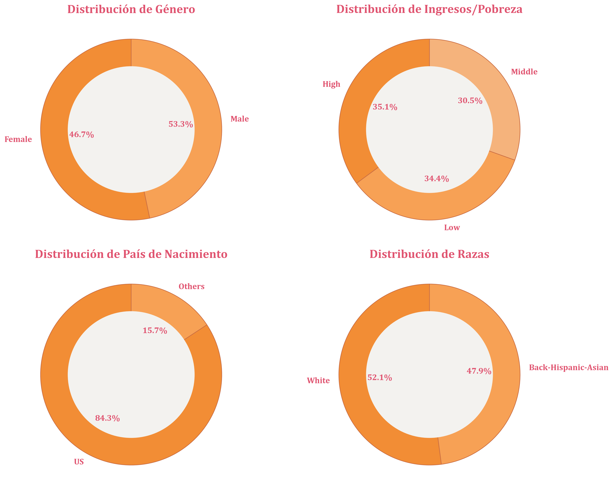
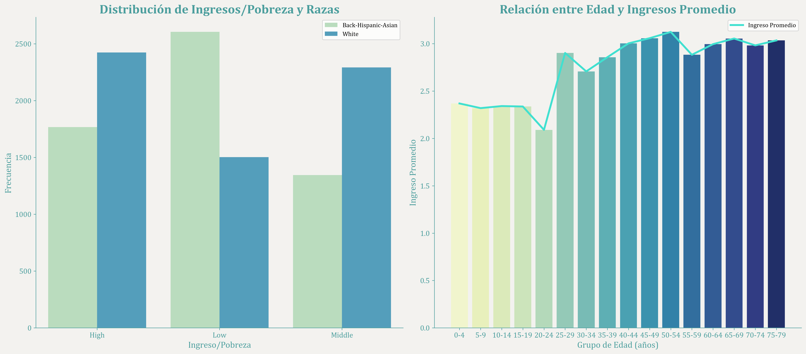
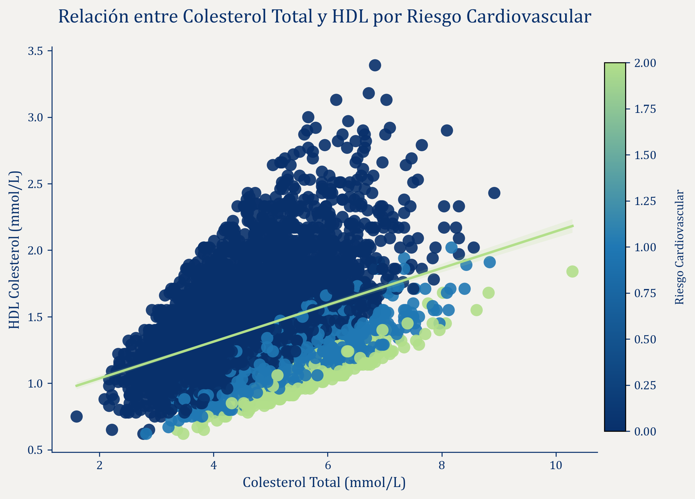
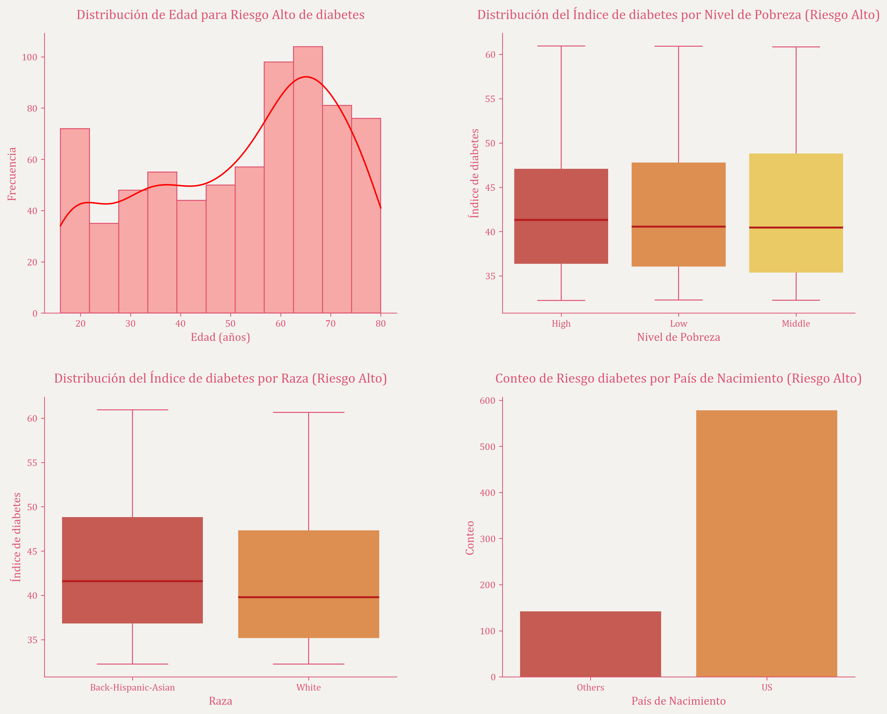

# EDA_Insurance_Company_Health_Clients

Here is the translation:

This entire project, along with its figures and statistics, has been done in Python.

In this exploratory analysis, an analysis will be carried out on a certain number of the insurer's clients, with the objective of seeing the general health status and the impact that the clients' general health status may have for the company.

First, I explored the population's demographic data by examining the different variables contained in the dataset and decided which were the most interesting to analyze.

Then, I explored how the population variables were related to each other.

Next, I explored the data related to laboratory tests by developing a series of indices such as BMI category, cardiovascular disease risk, diabetes, smoking population, and the risk of inflammatory diseases.

Finally, I analyzed how these disease risks were related to the different demographic variables of the population.

All of this led me to draw a series of conclusions, which, playing the role of working in a health insurance company, prompted me to make a series of predictions based on the most significant results about which risk groups would generate the highest costs for the insurer.